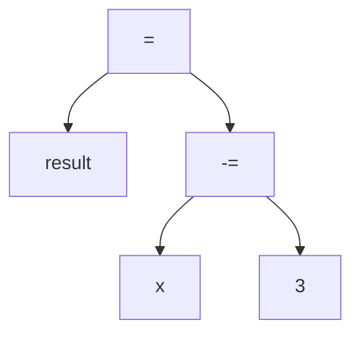
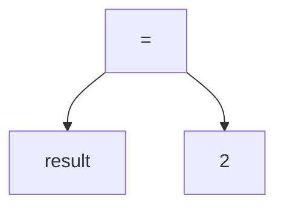
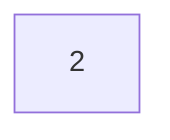

## 🏆 Trophies Wall

### 📊 Total Problems Solved
* 🐍 **Python: 34**
* 🚀 **C++: 54**

### 💡 Milestone Problems & Key Techniques
* **Rainy Season | Atcoder / abc175_a | https://atcoder.jp/contests/abc175/tasks/abc175_a?lang=en**
  * **Language:** C++
  * **Technique Level:** Basics / Emphasis
  * **Key Takeaway:** Less Related Conditions - else if 
  * **Explanation:** If condition A (having an ace card) is false, entering the else if branch implicitly guarantees that A is false while checking any other  condition B (the card is black) -even if less related-

* **Watch | Aizu / ITP1_1_D | https://judge.u-aizu.ac.jp/onlinejudge/description.jsp?id=ITP1_1_D**
  * **language:** C++
  * **Technique Level:** Easy
  * **Key Takeaway:** Expressions with Values
  * **Explanation:** A variable isn't the only thing that has a value, but also expressions do have. Expressions evaluate to values (e.g. x=5 as an expression evaluates to 5 then x=x-3 evaluates to 2), also boolean expressions evaluate to 1 if True and 0 if False.  Applying this we can use result=(x-=3) if we need to assign new values to both result and x instead of result=x-3; x-=3;

> Note: Since "-=" is an operator that has a side effect (subtract 3 from x then assigning the result to x), x changes and holds 2

> Note: result now holds the value 2

