## 🏆 Trophies Wall

### 📊 Total Problems Solved
* 🐍 **Python: 34**
* 🚀 **C++: 78**

### 💡 Milestone Problems & Key Techniques
* **Rainy Season | Atcoder / abc175_a | https://atcoder.jp/contests/abc175/tasks/abc175_a?lang=en**
  * **Language:** C++
  * **Technique Level:** Basics / Emphasis
  * **Key Takeaway:** Less Related Conditions - else if
  * **Explanation:** If condition A (having an ace card) is false, entering the else if branch implicitly guarantees that A is false while checking any other  condition B (the card is black) -even if less related-

* **General Idea**
  * **Language:** C++
  * **Technique Level:** Basics
  * **Key Takeaway:** Complexity Meaning - Input/Operations Relation
  * **Explanation:** Let the input size be N, if we find that the number of operations is exactly N²+2N+3 it is simplified to O(N²), because the complexity cares for the relation (function) type between the input & the number of operations executed as follow:  - Linear? &rarr;O(N) - Quadratic? &rarr;O(N²) - Logarithmic? &rarr;O(log(N)) - Constant (no relation between the input size & number of operations executed)? &rarr; O(1)  That's why a loop which has on 10^18 iterations is O(1) although it takes 37.1 years to execute

* **General Idea**
  * **Language:** C++
  * **Technique Level:** Basics
  * **Key Takeaway:** Generalization/Implicit Type Promotion
  * **Explanation:** Generalization is what happens when in one operation the two operands are of different datatypes, so the more general datatype prevails for the result

* **General Idea**
  * **Language:** C++
  * **Technique Level:** Easy
  * **Key Takeaway:** Reserved Bytes for Operation Result
  * **Explanation:** If an operation is being performed where the operands are whole numbers or evaluated to numerical values (like what happens when doing operations on characters), the compiler treats the operands as int datatype as long as it the value can fit in it (can be represented on 32 bits) and since the most general operand is of int datatype then we have only 32 bits (4 bytes) reserved for the result and if one of the operands where float or double,~7 digits & ~15 digits respectively would be reserved for the result. The most general operand has its bytes reserved for the result. The problem is what if for example:  int x = 1000000;//1e6 cout<<x*x;  Applying what we discussed, the result will overflow and won't fit in the reserved 4 bytes, so one of the following should be done to fix the problem:  1) Declare x as long long to **generalize** the whole operation to reserve 64 bits for the result.  2) multiply by 1LL (which is a normal 1 of data type long long) first:(1LL * x * x), or in a bracket that assures the **generalization** happens first:(x * (x * 1LL).  2LL &rarr; tells the compiler to consider this 2 of datatype long long (LL stands for long long to tell the compiler this isn't int) 2.0 &rarr; tells the compiler to consider this 2 of datatype double (floating-point numbers are by default considered double) 2.0f &rarr; tells the compiler to consider this 2 of datatype float (f stands for float to tell the compiler this isn't double)

* **Watch | Aizu / ITP1_1_D | https://judge.u-aizu.ac.jp/onlinejudge/description.jsp?id=ITP1_1_D**
  * **language:** C++
  * **Technique Level:** Easy
  * **Key Takeaway:** Expressions with Values
  * **Explanation:** A variable isn't the only thing that has a value, but also expressions do have. Expressions evaluate to values (e.g. x=5 as an expression evaluates to 5 then x=x-3 evaluates to 2), also boolean expressions evaluate to 1 if True and 0 if False.  Applying this we can use result=(x-=3) if we need to assign new values to both result and x instead of result=x-3; x-=3;
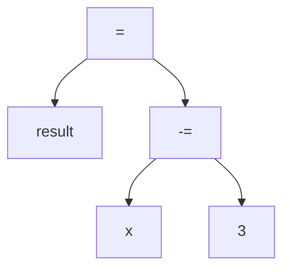
> Note: Since "-=" is an operator that has a side effect (subtract 3 from x then assigning the result to x), x changes and holds 2

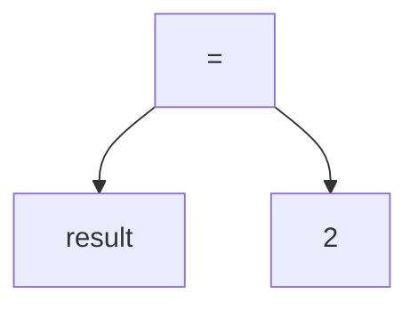
> Note: result now holds the value 2

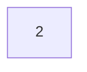

* **General Idea**
  * **Language:** C++
  * **Technique Level:** Range: Basics - Easy
  * **Key Takeaway:** Operation Precedence
  * **Explanation:** Operations have precedence meaning that some operations are evaluated before the others, for example; 5+10+9 is treated as (5+10)+9 And while this may be viewed as "no problem" as it still aligns with mathematical rules, it is actaully a big problem as follows:   if int x = 1000000; cout<<x * x; needs to be generalized into 64 bits to not overflow So if we choose to generalize by (* 1LL) we have to regard precedence: 1LL * x * x which is treated as (1LL * x) * x but for: x * x * 1LL:  x * x will give the overflowed result first then this result is generalized to long long by (1LL) so we have to use parentheses as follows: x * (x * 1LL) for the generalization to happen first in the bracket, and careful for x * x  *(x * 1LL) as the multiplication is evaluated from left to right so x * x will give an overflowed result first.
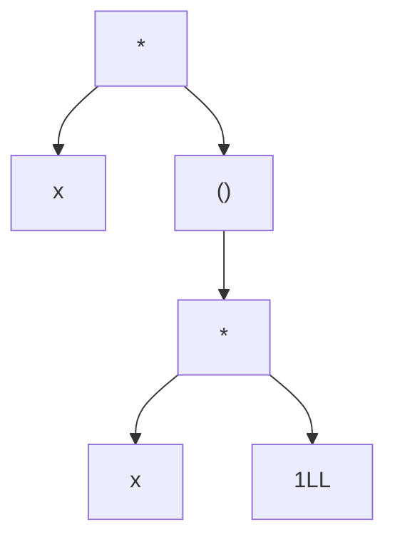

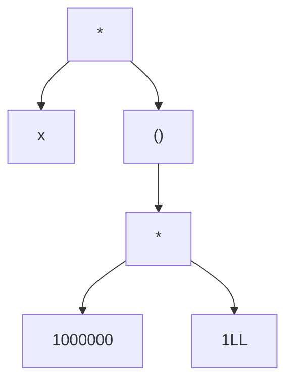

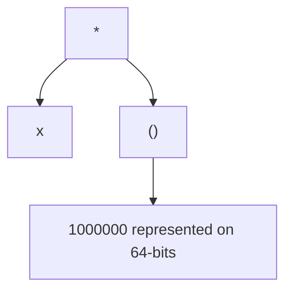
> Note: The 1000000 was generalized/promoted to long long and had 64-bit reserved since then

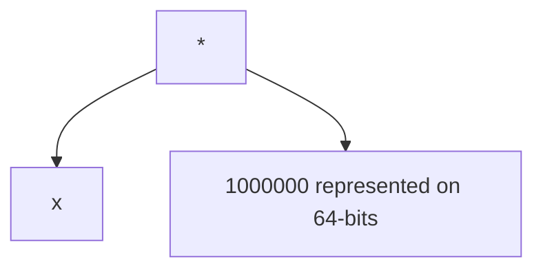

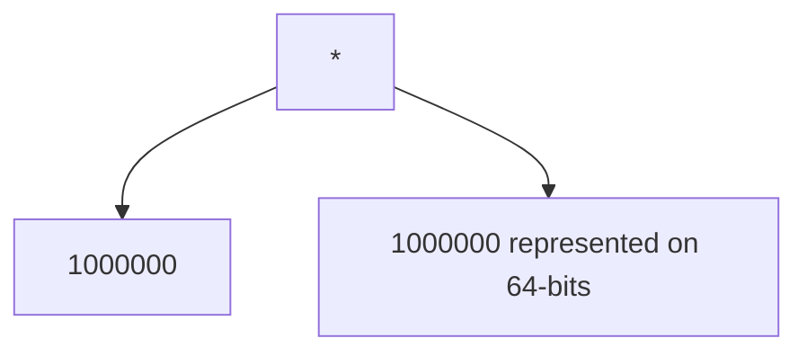
> Note: the other 1000000 (still represented on 32 bits) will be promoted to long long and have 64 bits reserved for it

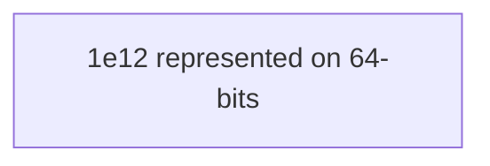
Another Example: float x = 5/2 stores 2 in x although x is float, due too the higher precedence of / operator compared for the = operator, & since 5 and 2 are int values, int division is performed after that, the float-point-truncated result is assigned to x; 
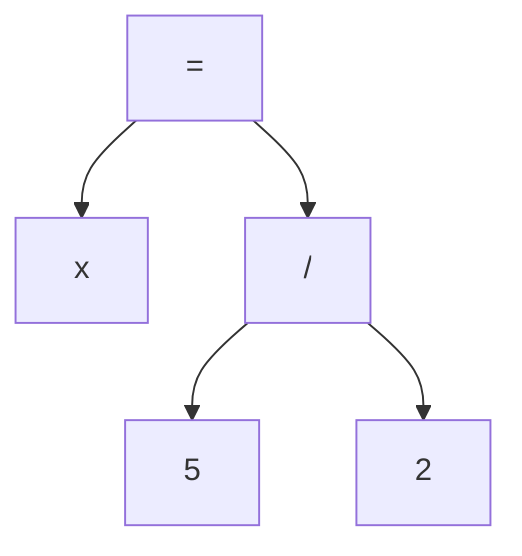

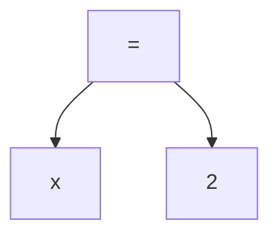
> Note: x now has 2 assigned to it as = is an operator with a side effect (which is assigning new values to the left operand)

